# Flash Translation Layer (FTL)-Based SSD Storage Simulator (C++)

A menu-driven C++ simulator that models the core behavior of an SSD Flash Translation Layer (FTL), including logical-to-physical address mapping, block/page management, wear leveling, garbage collection, persistent storage, and object-oriented storage device abstraction.

---

## Features

- Flash Translation Layer (FTL) with Logical-to-Physical (L2P) Address Mapping
- Block and Page Management
- Read, Write, Update, Delete Operations
- Wear Leveling using Priority Queue
- Garbage Collection
- TRIM Operation
- Over-Provisioning Support
- Write Amplification Tracking
- Binary Save and Load
- SSD/HDD Polymorphism
- Boundary Test Suite
- Storage Statistics

---

## Why this Project

Modern SSD firmware relies on efficient address translation, wear leveling, garbage collection, and flash memory management to ensure high performance and reliability.

This project simulates the software layer of an SSD controller, allowing these core storage mechanisms to be implemented, tested, and visualized without requiring physical hardware.

---

## Technologies Used

- C++17
- Object-Oriented Programming
- Standard Template Library (STL)
- File Handling
- Exception Handling

### STL Containers

- `vector`
- `unordered_map`
- `queue`
- `priority_queue`

---

## Build & Run

### Linux

```bash
make
./ssd_sim
```

### Windows (MinGW)

```bash
g++ -std=c++17 -Wall -Iinclude src/*.cpp -o ssd_sim.exe
ssd_sim.exe
```

Requires a C++17 compatible compiler.

---

## Project Structure

```
SSD_Storage_Simulator
│
├── include/
│   ├── Block.h
│   ├── Cache.h
│   ├── Controller.h
│   ├── HDD.h
│   ├── Page.h
│   ├── SSD.h
│   ├── SSDException.h
│   ├── Statistics.h
│   ├── StorageDevice.h
│   └── TestSuite.h
│
├── src/
│   ├── Block.cpp
│   ├── Cache.cpp
│   ├── Controller.cpp
│   ├── HDD.cpp
│   ├── Page.cpp
│   ├── SSD.cpp
│   ├── Statistics.cpp
│   ├── TestSuite.cpp
│   └── main.cpp
│
├── data/
├── README.md
└── Makefile
```

---

## System Architecture

## System Architecture

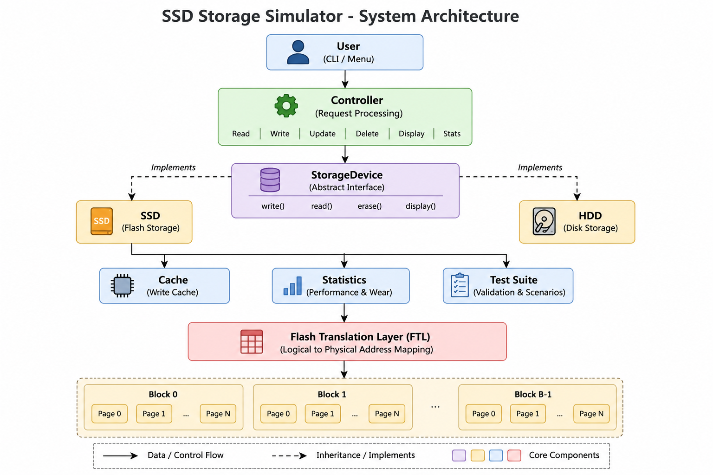

The simulator follows a layered object-oriented architecture centered around the abstract `StorageDevice` interface. The `Controller` communicates with storage devices through runtime polymorphism, while the SSD implementation manages Flash Translation Layer (FTL), block/page allocation, wear leveling, and garbage collection.

---

## OOP Concepts Demonstrated

- Encapsulation
- Abstraction
- Inheritance
- Polymorphism
- Modular Class Design

---
## UML Class Diagram

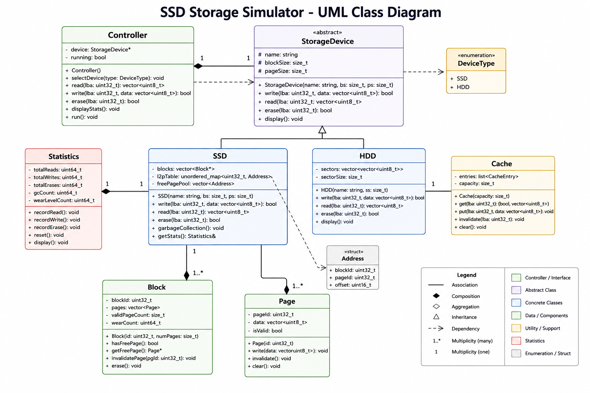

The class diagram illustrates the relationships between the controller, storage devices, blocks, pages, cache, statistics module, and test suite using inheritance, composition, and associations.
## Storage Algorithms Implemented

- Flash Translation Layer (FTL)
- Logical-to-Physical Address Mapping
- Wear Leveling
- Garbage Collection
- Write Amplification Tracking
- TRIM Operation
- Over-Provisioning

---

## Key Data Structures

| STL Structure | Purpose |
|---------------|---------|
| `vector<Block>` | Stores SSD blocks |
| `vector<Page>` | Stores pages inside each block |
| `unordered_map<int,int>` | Logical-to-Physical Address Mapping (L2P Table) |
| `queue<int>` | Pending write requests |
| `priority_queue` | Wear Leveling (Least Worn Block Selection) |
| `sort()` | Statistics display based on wear count |
## Garbage Collection Workflow

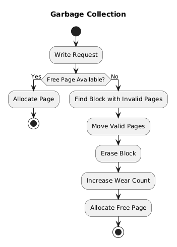

Illustrates the garbage collection process performed when insufficient free pages are available. Valid pages are migrated before the block is erased and reused.
---

## Design Decisions

### Page States

Each page exists in one of three states:

- FREE
- VALID
- INVALID

An invalid page cannot be overwritten directly. Instead, a new page is allocated and the old page is marked invalid, matching real NAND flash behavior.

---

### Garbage Collection

Garbage Collection is triggered when a block contains a high ratio of invalid pages.

The process:

1. Copy all valid pages.
2. Erase the block.
3. Increase wear count.
4. Reuse the block for future writes.
## Flash Translation Layer (FTL)

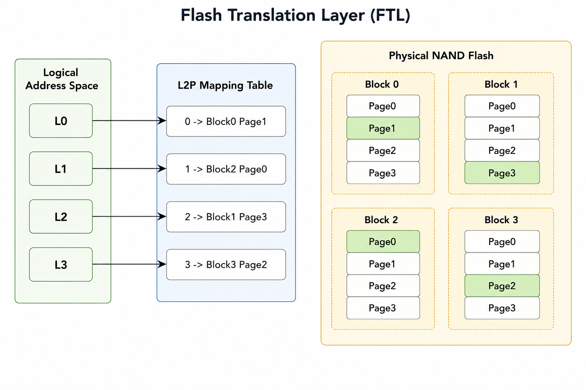

The Flash Translation Layer maintains a Logical-to-Physical (L2P) mapping table that translates logical block addresses into physical NAND locations.
---

### Wear Leveling

A min-heap (`priority_queue`) selects the least worn block for allocation.

Lazy deletion is used to discard stale heap entries after erase operations.

---

### SSD vs HDD

The simulator supports two storage devices through a common abstract interface.

| SSD | HDD |
|------|------|
| Block/Page Architecture | Sequential Sectors |
| Wear Leveling | No Wear Leveling |
| Garbage Collection | No Garbage Collection |
| FTL Mapping | Direct Sector Access |

This demonstrates runtime polymorphism using the same interface.

---

## Save / Load

The simulator supports persistent storage using binary files.

The saved state includes:

- SSD Configuration
- Block Information
- Page States
- Wear Counts
- Logical-to-Physical Mapping Table
- Storage Statistics

---

## Boundary Tests

The automated test suite validates:

- Empty Read
- Invalid Address Read
- Duplicate Write
- Update on Invalid Address
- SSD Full Condition

All tests report PASS/FAIL results.

---

## Sample Output

```
[Test] Empty read on a brand new SSD ... PASS

[Test] Duplicate write to same address ... PASS

[Test] SSD Full ... PASS

[Test] Invalid Address ... PASS
```

---

## Screenshots

### Main Menu

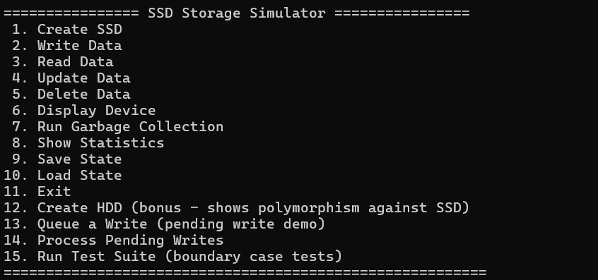

---

### SSD Creation

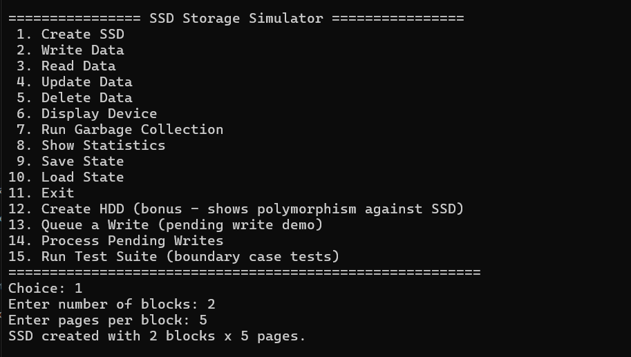

---

### Write Operation

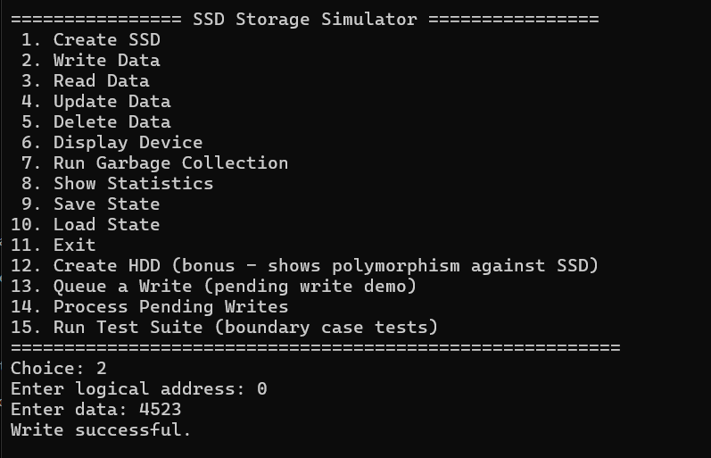

---

### Read Operation

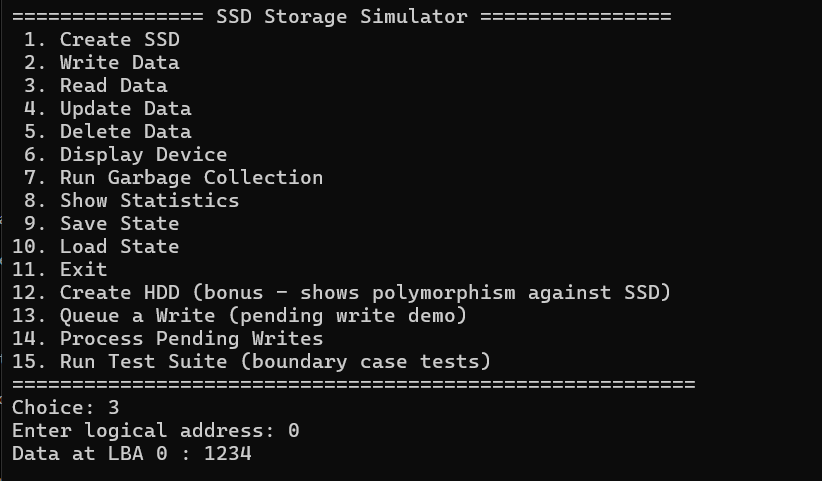

---

### Storage Statistics

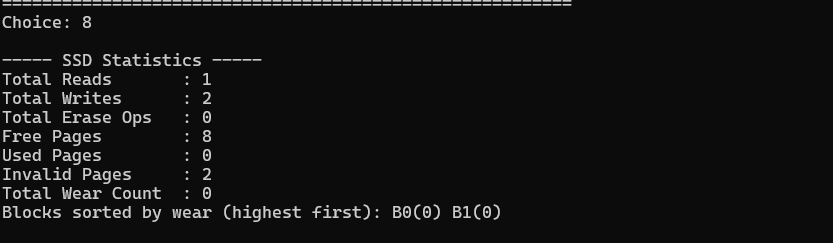

---

### Save / Load State

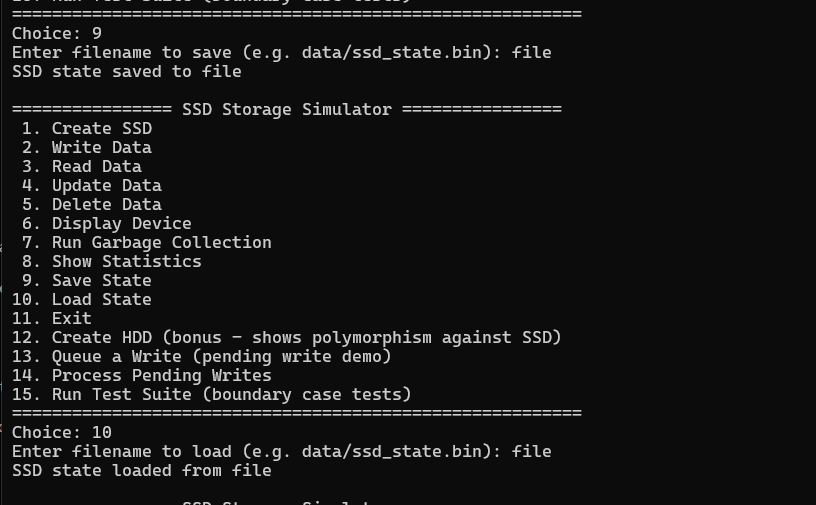

---

### Automated Boundary Test Suite

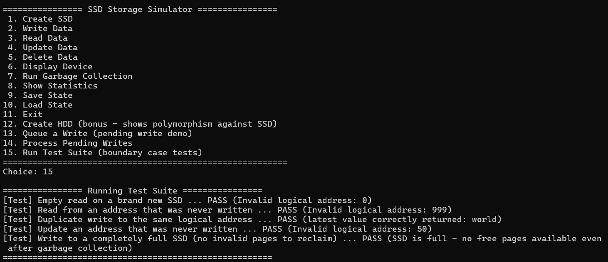

## Future Improvements

- NVMe Command Simulation
- Multi-threaded I/O Scheduling
- ECC Simulation
- Bad Block Management
- Read Cache Optimization
- Performance Benchmarking
- Graphical SSD Visualization

---

## Author

**Bhagyashree Yadagiri**

Computer Science & Engineering

KLE Technological University

---

## License

This project is intended for educational and learning purposes.
